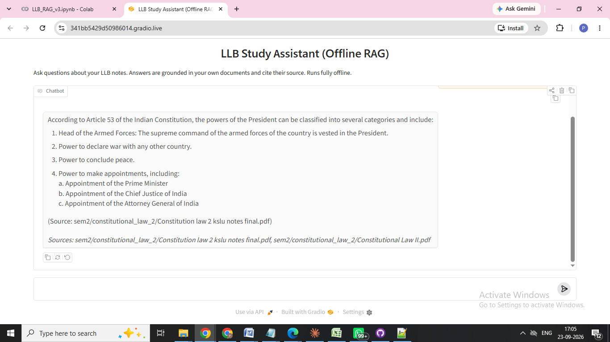

# LLB RAG — Offline Study Assistant

**Ask questions about your own law notes and get answers grounded in them, with sources, using a fully offline RAG pipeline (no API keys).**

[](https://colab.research.google.com/github/Pravin-Shri-Kumar/llb-rag-offline/blob/main/LLB_RAG.ipynb)

---

## The problem it solves

Law students collect a lot of material: textbooks, class notes, model answers, bare-act extracts. During revision, finding *"what did my notes say about a contract of indemnity?"* means flipping through dozens of PDFs. A general chatbot can answer, but it may invent section numbers or case names, and it doesn't know *your* material.

This project builds a **Retrieval-Augmented Generation (RAG)** assistant that searches your own documents first, then has a local language model answer **only from what it found**, citing the source file. Everything runs on free, open-source models, so there are no API keys, no cost and no data sent to a third party.

It was built as a capstone project for an Agentic AI course, using my KSLU 3-year LLB (Semester 2) study materials.

## Key features

- **Fully offline / self-hosted.** Embeddings with `sentence-transformers`, vector search with ChromaDB, answers from `llama3.2:3b` via Ollama.
- **Source-cited answers.** Every answer lists the files it was grounded in.
- **Semester and subject filters.** Ask within one subject, e.g. `rag_answer(q, subject="property_law")`.
- **Persistent vector database.** It's built once and reused across Colab sessions (the `REBUILD` switch).
- **Conversation memory.** Follow-up questions like *"what about property law?"* understand the previous turns.
- **Two interfaces.** A terminal-style chat loop and a Gradio chat UI.
- **Self-healing.** `ensure_ollama()` restarts the local LLM server if Colab drops it.
- **Teaching notebook.** Each of the 4 RAG stages is its own section and prints what it produced.

## Screenshot



## How it works

| Stage | What happens | Tool |
|---|---|---|
| 1. Load & Chunk | Read PDF / DOCX / TXT files, split into 800-character overlapping passages | `pypdf`, `python-docx` |
| 2. Embed | Turn each passage into a 384-number meaning vector | `sentence-transformers` (`all-MiniLM-L6-v2`) |
| 3. Store & Retrieve | Save vectors; find the passages nearest to the question | `chromadb` |
| 4. Generate | Local LLM answers using only the retrieved passages | Ollama (`llama3.2:3b`) |

## Tech stack

- Python 3, Jupyter notebook on **Google Colab** (free T4 GPU)
- `sentence-transformers`, `chromadb`, `pypdf`, `python-docx`
- **Ollama** + `llama3.2:3b` (local LLM)
- **Gradio** (chat UI)

## Project structure

```
llb-rag-offline/
├── LLB_RAG.ipynb       # the notebook: run top to bottom
├── config.py           # all settings: paths, chunk size, models, top-K
├── requirements.txt
├── documents/          # your study files go here (only a demo file is included)
│   └── sem2/constitutional_law_2/sample_powers_of_president_answer.txt
└── docs/               # screenshot for this README
```

`vector_db/` is created automatically when you run the notebook and is not committed.

## Setup & run (Google Colab)

The notebook reads its files from Google Drive at **`My Drive/LLB RAG`**.

1. **Get the code.** On this repo page click **Code → Download ZIP** and unzip it.
2. **Put it in Drive.** In Google Drive, create a folder named exactly `LLB RAG` in *My Drive*, and upload the unzipped contents into it (`LLB_RAG.ipynb`, `config.py`, `documents/`).
3. **Add your documents.** Drop your own PDF / DOCX / TXT notes into `documents/` (e.g. `documents/sem2/property_law/`). The included sample file lets you test straight away.
4. **Open the notebook.** In Drive, double-click `LLB_RAG.ipynb` → *Open with Google Colaboratory*.
5. **Choose a GPU.** *Runtime → Change runtime type → T4 GPU*.
6. **Run all cells** from top to bottom. The first run installs packages, downloads the model (~2 GB) and builds the database.
7. **Chat.** The last section launches a Gradio chat window. Open the link it prints.

**Tips**
- After the first successful build, set `REBUILD = False` in Stage 3 to reuse the saved database. Set it back to `True` whenever you add new documents.
- To use a different Drive folder, change `PROJECT_ROOT` in `config.py` and in cell 0.2.

## Where the data comes from

The system works on **whatever documents you put in `documents/`**. I used my own KSLU LLB study materials. Textbooks, printed notes and other third-party material are copyrighted, so they are **not** included in this repository. The only file included is one self-written model answer (Constitutional Law II, powers of the President) for demonstration.

## Future improvements

- Wrap `rag_answer()` as a **tool for an AI agent** that decides when to retrieve and plans multi-step answers.
- Smarter chunking that splits by headings and sections instead of fixed character counts.
- A **re-ranker** to improve which passages reach the LLM.
- OCR support for scanned PDFs.
- A small evaluation set of questions to measure retrieval and answer quality.
- A local (non-Colab) run mode and Kannada-language support.

## License

[MIT](LICENSE) © 2026 Pravin Shri Kumar
